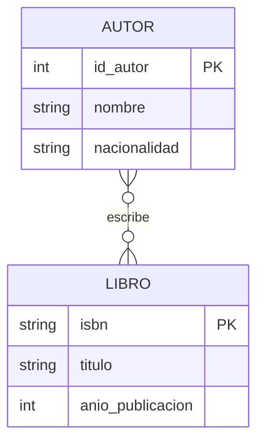
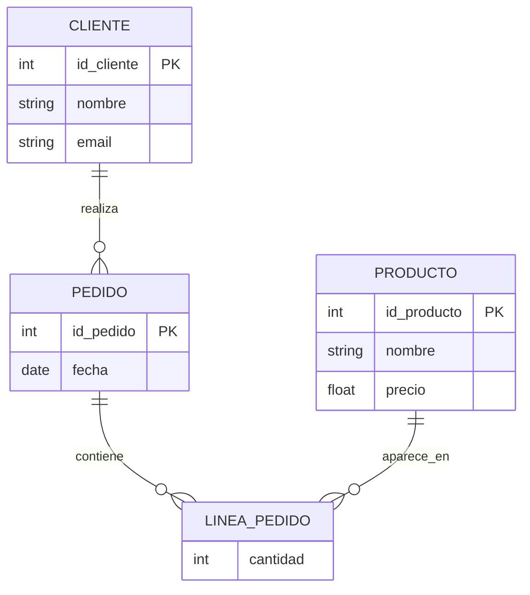
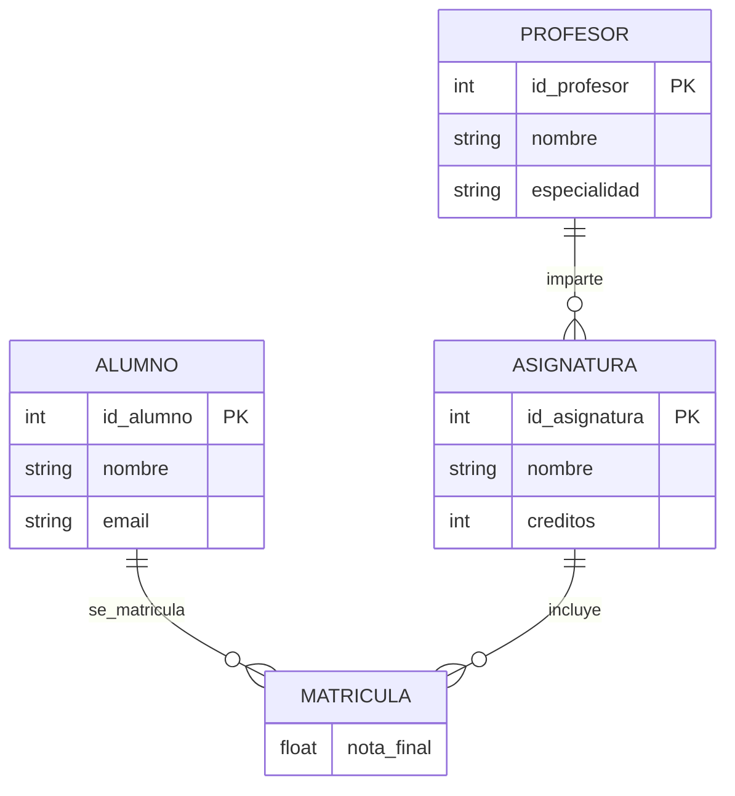
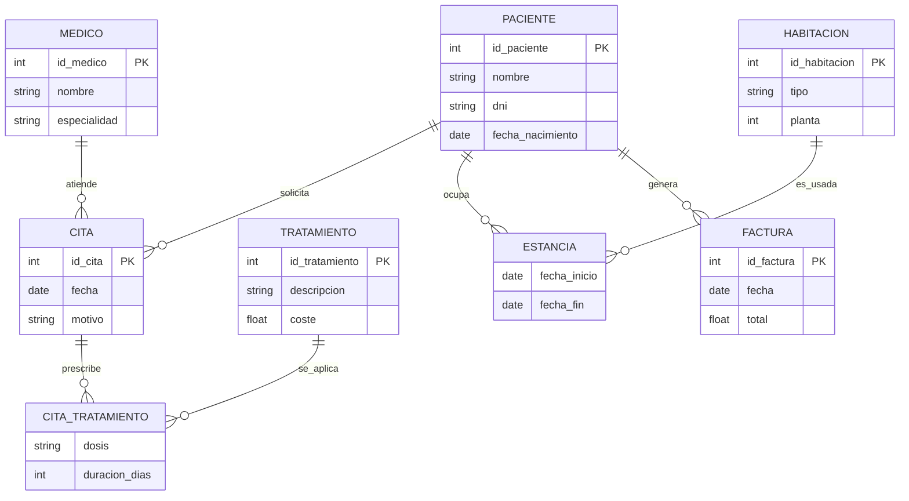
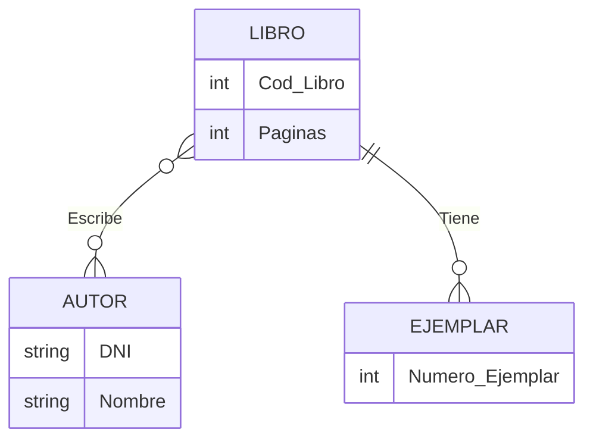
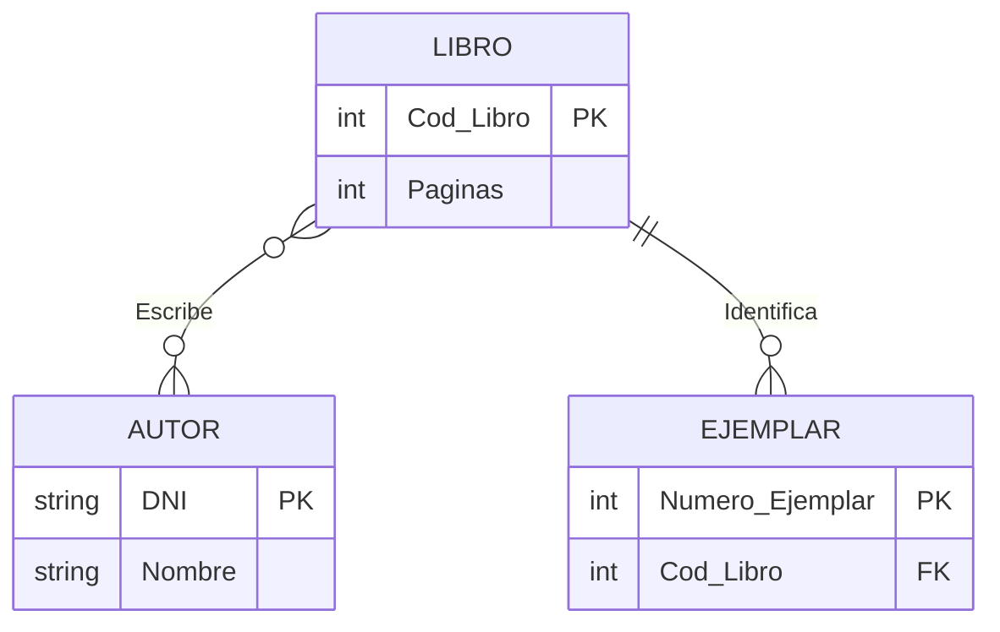
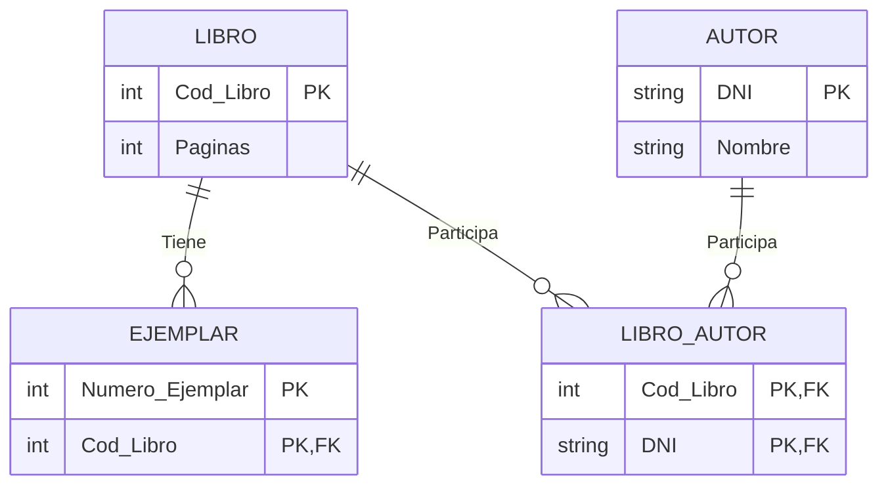

# 📝 Ejercicio 1 — Biblioteca
## 📌 Enunciado
Una biblioteca desea gestionar la información de sus libros y los autores que los escriben.
Cada libro tiene un ISBN, título y año de publicación.
Cada autor tiene un id, nombre y nacionalidad.
Un libro puede tener uno o varios autores.
Un autor puede escribir varios libros.
---
## 🧠 Análisis
- Entidades: LIBRO, AUTOR
- Relación: N:M → Escribe
---

# 📝 Ejercicio 2 — Tienda Online
## 📌 Enunciado
Una tienda online necesita almacenar información sobre clientes, pedidos y productos.
Un cliente puede realizar varios pedidos.
Cada pedido pertenece a un único cliente.
Un pedido contiene uno o varios productos.
De cada producto se guarda: id, nombre y precio.
De cada pedido: número, fecha.
---
## 🧠 Análisis
- Entidades: CLIENTE, PEDIDO, PRODUCTO
- Relación 1:N → Cliente–Pedido
- Relación N:M → Pedido–Producto
---

# 📝 Ejercicio 3 — Centro Educativo
## 📌 Enunciado
Un centro educativo quiere gestionar alumnos, asignaturas y profesores.
Un alumno puede matricularse en varias asignaturas.
Una asignatura puede tener varios alumnos.
Cada asignatura es impartida por un único profesor.
Un profesor puede impartir varias asignaturas.
De la matrícula interesa guardar la nota final.
---
## 🧠 Análisis
- Relación N:M → Alumno–Asignatura
- Relación 1:N → Profesor–Asignatura
- Entidad asociativa: MATRICULA
---

# 📝 Ejercicio 4 — Sistema de Gestión Hospitalaria
## 📌 Enunciado
Un hospital quiere gestionar la información de pacientes, médicos, citas, tratamientos, habitaciones y facturas.
Condiciones:
Un paciente puede tener varias citas médicas.
Cada cita es atendida por un solo médico.
Un médico puede atender muchas citas.
En una cita se puede prescribir uno o varios tratamientos.
Un tratamiento puede aparecer en distintas citas.
Un paciente puede estar asignado a una habitación.
Una habitación puede alojar a varios pacientes en distintos periodos.
A cada paciente se le genera una o varias facturas.
---
## 🧠 Análisis
- Entidades detectadas (7)
-- PACIENTE
-- MEDICO
-- CITA
-- TRATAMIENTO
-- CITA_TRATAMIENTO (entidad asociativa)
-- HABITACION
-- FACTURA
- Relaciones clave
-- PACIENTE 1:N CITA
-- MEDICO 1:N CITA
-- CITA N:M TRATAMIENTO
--PACIENTE N:M HABITACION (histórico)
-- PACIENTE 1:N FACTURA
---

---
# 📝 Ejercicio 5 — Biblioteca
## 📌 Enunciado
- Se quiere registrar los libros,autor y ejemplares de una biblioteca. Debes hacer el modelo ER y el modelo modificado.
---

- 📌 Notas
Escribe es N:M entre Libro y Autor
Tiene es 1:N entre Libro y Ejemplar
## 2️⃣ Esquema ER Modificado
### Entidad Debil

### Tabla Nueva
---
---

