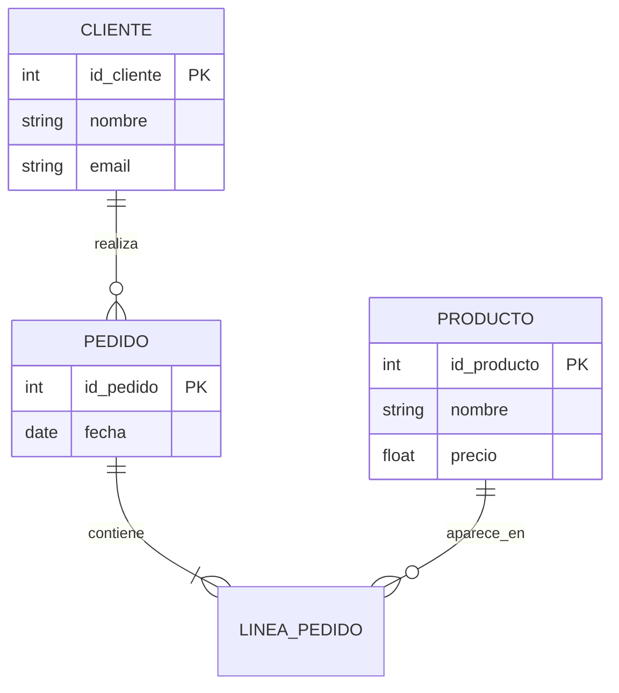

# Base_De_Datos
# 📊 Modelo Entidad–Relación (MER)
El **Modelo Entidad–Relación (MER)** es una herramienta de modelado conceptual utilizada para diseñar bases de datos. Permite representar de forma gráfica y estructurada la información del mundo real y las relaciones entre sus elementos antes de implementarla en un SGBD.
---
## 📌 Objetivos del MER
- Analizar y comprender los requisitos del sistema
- Identificar entidades, atributos y relaciones
- Diseñar una base de datos coherente y sin redundancias
- Servir de puente entre el análisis y el modelo relacional
---
## 🧱 Componentes del Modelo Entidad–Relación
### 🔹 Entidad
Representa un objeto o concepto del mundo real con existencia propia.
**Tipos de entidades:**
- **Entidad fuerte**: Tiene identificador propio
- **Entidad débil**: Depende de otra entidad para su identificación
**Ejemplos:**  
`Cliente`, `Producto`, `Empleado`
---
### 🔹 Atributo
Propiedad o característica de una entidad o relación.
**Tipos de atributos:**
- **Simples**: No se pueden descomponer (`edad`)
- **Compuestos**: Se dividen en subatributos (`dirección`)
- **Monovalorados**: Un solo valor
- **Multivalorados**: Varios valores (`teléfonos`)
- **Derivados**: Se calculan a partir de otros (`edad` desde fecha_nacimiento)
- **Clave**: Identifica de forma única a una entidad
---
### 🔹 Claves
- **Clave primaria (PK)**: Identificador único
- **Clave candidata**: Posible clave primaria
- **Clave alternativa**: Clave candidata no elegida
- **Clave foránea (FK)**: Referencia a otra entidad
---
## 🔗 Relación
Asociación entre dos o más entidades.
**Grado de la relación:**
- Unaria (reflexiva)
- Binaria
- Ternaria
**Cardinalidad:**
- 1 : 1
- 1 : N
- N : M
**Participación:**
- **Total**: Obligatoria
- **Parcial**: Opcional
---
## 🔁 Entidades Débiles
- No tienen clave primaria propia
- Se identifican mediante:
  - Clave parcial
  - Clave primaria de la entidad fuerte
- Relación identificadora (doble rombo)
---
## 🧬 Generalización y Especialización
Permite representar jerarquías entre entidades.
- **Generalización**: Varias entidades → una más general
- **Especialización**: Una entidad → varias más específicas
**Restricciones:**
- **Disjunta / Solapada**
- **Total / Parcial**
Ejemplo:
Persona
├── Alumno
└── Profesor
---
## 🧠 Reglas del Modelo ER
- Cada entidad debe tener una clave primaria
- Los atributos deben ser atómicos
- Evitar redundancias
- Las relaciones deben tener sentido semántico
---
## 🔄 Paso a Modelo Relacional
Conversión del MER a tablas:
- Entidades → Tablas
- Atributos → Columnas
- Claves → PK y FK
- Relaciones N:M → Tabla intermedia
- Entidades débiles → PK compuesta
---
- Los ejercicios se mostraran así

  

