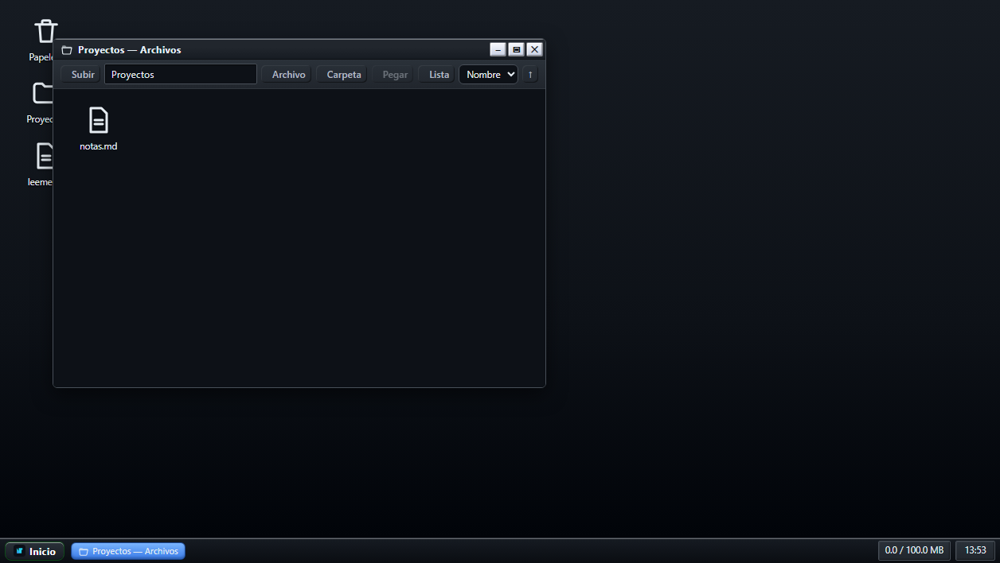
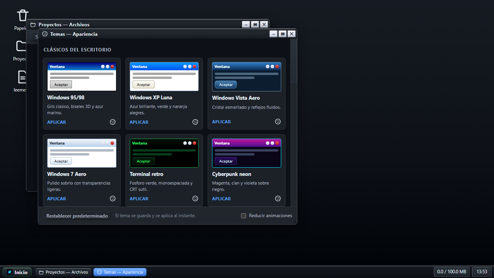

<p align="center">
  
</p>

<h1 align="center">ViMap</h1>

<p align="center">
  <strong>Tu sistema operativo personal en la nube: escritorio, archivos y vault cifrado, accesibles desde cualquier dispositivo.</strong>
</p>

<p align="center">
  
  
  
  
</p>

<p align="center">
  
</p>

## Qué es ViMap

ViMap recrea la experiencia de un escritorio clásico (ventanas, barra de tareas, menú Inicio, papelera, bloc de notas) sobre un **vault personal cifrado de extremo a extremo**. Tus archivos, carpetas y notas viajan cifrados y se descifran solo en tu navegador: el servidor nunca ve tu contenido.

- 🖥️ **Escritorio real**: ventanas arrastrables, maximizar/minimizar, multiselección, drag & drop que mueve, atajos estilo Windows.
- 📁 **Explorador completo**: crear, renombrar, mover, copiar, papelera con restauración, versiones de archivo, vista rejilla/lista, favoritos y recientes.
- 🎨 **22 temas visuales**: de Windows 95 al cristal de Vista, terminal retro, cyberpunk y una categoría de “Universos y géneros”.
- 🔍 **Búsqueda global**, visores de Markdown, código, imagen, PDF y texto.
- 👥 **Multiusuario con cuotas** y panel de administración.
- 🔐 **Cero conocimiento**: AES-256-GCM en cliente, PBKDF2-SHA256, sesiones HttpOnly, anti-CSRF y rate-limiting.

<p align="center">
  
</p>

## Puesta en marcha (2 minutos, en local)

Requisitos: Node ≥ 18 y `wrangler` CLI.

```bash
npm run dist
wrangler d1 migrations apply vimap-db --local
wrangler dev                # http://localhost:8787 (front + API)
```

La primera vez verás la pantalla de configuración: crea el administrador con tu `ADMIN_SETUP_TOKEN`.

## Despliegue en Cloudflare

```bash
npm run validate            # valida estructura, bindings, ESM y secretos
npm run dist                # ensambla dist/ (front para el binding ASSETS)

wrangler d1 create vimap-db # copia el database_id a wrangler.json
wrangler d1 migrations apply vimap-db --local   # desarrollo
wrangler d1 migrations apply vimap-db           # producción
wrangler secret put ADMIN_SETUP_TOKEN           # token para crear el primer admin
wrangler deploy             # publica Worker + static assets en tu *.workers.dev
```

Tras desplegar, crea el primer admin (POST una sola vez):

```bash
curl -X POST https://<tu-worker>.workers.dev/api/admin/setup \
  -H "Content-Type: application/json" \
  -d '{"token":"<ADMIN_SETUP_TOKEN>","username":"admin","displayName":"Administrador","password":"<min-12-caracteres>"}'
```

A partir de ahí entras en `#/admin` para crear más cuentas.

> Nota: `wrangler d1 migrations apply` requiere que `database_id` en
> `wrangler.json` no sea el placeholder `REPLACE_WITH_D1_DATABASE_ID`.

## Modelo de seguridad

- **Cifrado en el cliente.** Nombres, rutas, papelera, versiones y contenido viven en un *manifest* cifrado con AES-256-GCM (PBKDF2-SHA256). El servidor solo almacena ciphertext.
- **Claves separadas.** Del password se derivan dos materiales con salts distintos: *login* (el servidor guarda el hash y verifica) y *vault* (solo existe en tu navegador; el servidor no puede obtenerla).
- **Concurrencia optimista.** Cada vault tiene revisión (`rev`): ante escritura simultánea el servidor responde `409`, el cliente fusiona por ruta y reintenta.
- **Blobs content-addressed.** `key = sha256(sobre)`; mover/renombrar no re-sube nada y el servidor purga lo no referenciado.
- **Sesiones y API.** Cookie `vimap_session` HttpOnly (`Secure` solo en HTTPS) + `SameSite=Lax`; mutaciones con `X-Vimap: 1`; login limitado (5/min por usuario e IP, 10/hora en setup); cabeceras `nosniff`, HSTS, `X-Frame-Options: DENY` y CSP estricta.
- **Aislamiento total.** Cada recurso se deriva de la sesión en servidor; verificado contra IDOR entre usuarios.
- El cambio de contraseña no está soportado (invalidaría el cifrado): documentado en “Mi cuenta”.

## API (todas bajo `/api`, misma cookie de sesión)

| Método y ruta | Descripción |
| --- | --- |
| `POST /admin/setup` | Alta del primer admin (token de un solo uso, con throttle). |
| `POST /login` · `POST /logout` | Sesión (cookie HttpOnly). |
| `GET /me` | Datos del usuario actual (rol, cuota). |
| `GET /sessions` · `DELETE /sessions/:id` | Sesiones propias y revocación remota. |
| `GET /vault` | `vaultSalt`, `vaultIterations`, `rev`, `manifestText`, `blobKeys`. |
| `GET /vault/blobs/:key` · `PUT /vault/blobs/:key` | Sobres cifrados (content-addressed). |
| `PUT /vault/manifest` | Push optimista: `{ baseRev, manifestText, blobKeys }` → `rev` nuevo o `409`. |
| `GET/POST /admin/users` · `PATCH/DELETE /admin/users/:id` | Gestión de usuarios (admin). |
| `GET /admin/stats` | Totales de usuarios, cuota y blobs (admin). |

## Límites (plan gratuito de Cloudflare)

Sin R2 no hay nada que activar ni método de pago asociado.

- **Archivo por tope:** 32 MB de sobre cifrado (~24 MB de texto útil).
- **Fila D1:** sobres troceados en filas de ≤1,5 MB; manifest en `vaults.manifest` (máx. ~1,9 MB).
- **Cuota por usuario:** 100 MiB por defecto, ajustable por usuario en `#/admin` (los 5 GB de D1 se reparten entre usuarios).
- **D1 free:** 5 GB en la cuenta, 5 M filas leídas/día, 100 k escritas/día; al superar un límite diario la API devuelve error hasta medianoche UTC, sin cargos ni pérdida.

## Copias de seguridad

- Desde la app: “Copia de seguridad” descarga un *bundle* (`vimap-backup-<fecha>.json`) con manifest y blobs cifrados.
- Desde Node: `node scripts/encrypt-vault.mjs` / `decrypt-vault.mjs` (o se pide password por stdin).
- Base de datos: `npm run backup:local` / `npm run backup:remote` (SQL en `backups/`).

## Atajos y preferencias

- 22 temas (Inicio → “Cambiar tema…”), con persistencia local, modo sistema y “Reducir animaciones”.
- Búsqueda con `/` o `Ctrl/⌘ K`; filtros `ext:`, `lang:`, `path:`, `tag:`.
- Explorador: `Ctrl+A/C/X/V`, `F2`, `Supr`/`Shift+Supr`, `Alt+←/→/↑`, `F5`; en el editor `Ctrl/⌘ + Enter` guarda.

## Seguridad y operación

- Define `ADMIN_SETUP_TOKEN` robusto en producción y rótalo si se expone
  (`wrangler secret put ADMIN_SETUP_TOKEN`). El endpoint de setup tolera
  10 intentos/hora.
- Copias de la base de datos: `npm run backup:local` (desarrollo) o
  `npm run backup:remote` (producción, SQL en `backups/`).
- La API exige `X-Vimap: 1` en mutaciones, cookies `HttpOnly` (`Secure` solo
  en HTTPS) y limita el login (5/min por usuario e IP); emite `nosniff` y HSTS.
- El cambio de contraseña no está soportado (invalidaría el cifrado del vault);
  documentado en “Mi cuenta”.
- Política de privacidad y contacto de seguridad: pendientes de definir antes
  del lanzamiento público.

## Estado y hoja de ruta

✅ Vault cifrado multiusuario · explorador completo · 22 temas · sesiones revocables · favoritos/recientes · auditoría de seguridad superada.
🔜 Importar bundle en la UI · compartir por enlace (con permisos) · 2FA · modo offline.

## Estructura

```
wrangler.json  Worker: sirve dist/ y /api/* en el mismo origen
  └─ D1 (DB)   users, sessions, vaults, blobs, blob_chunks, login_attempts
Frontend (SPA, sin frameworks, ES modules)
  assets/js/main.js · crypto/ · desktop/ · viewers/ · core/
```
